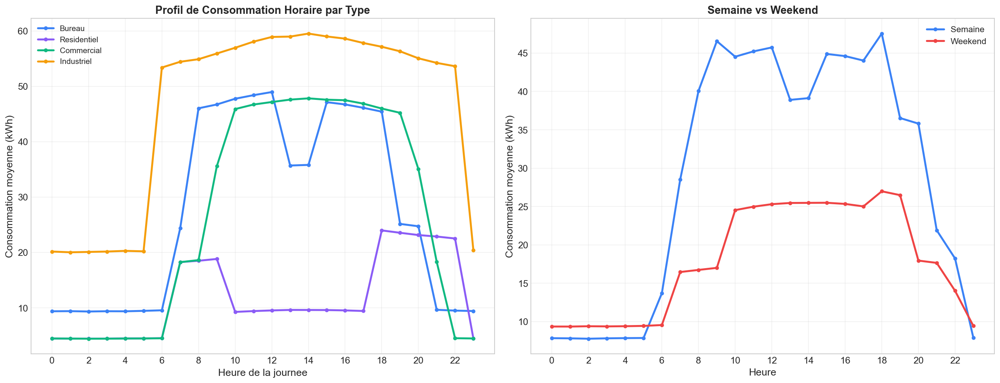
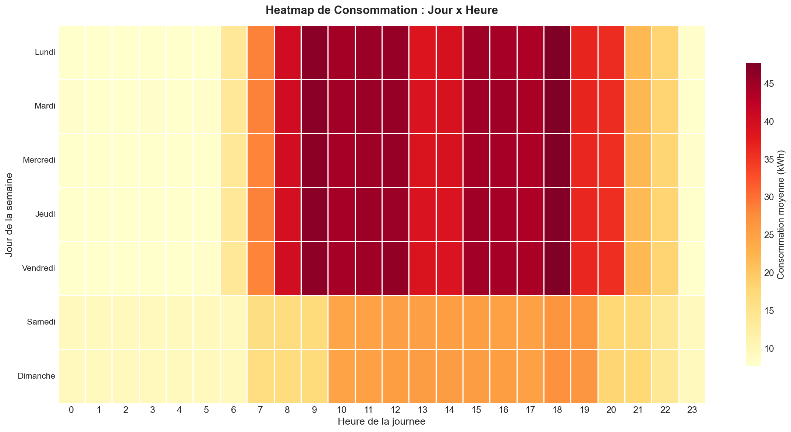
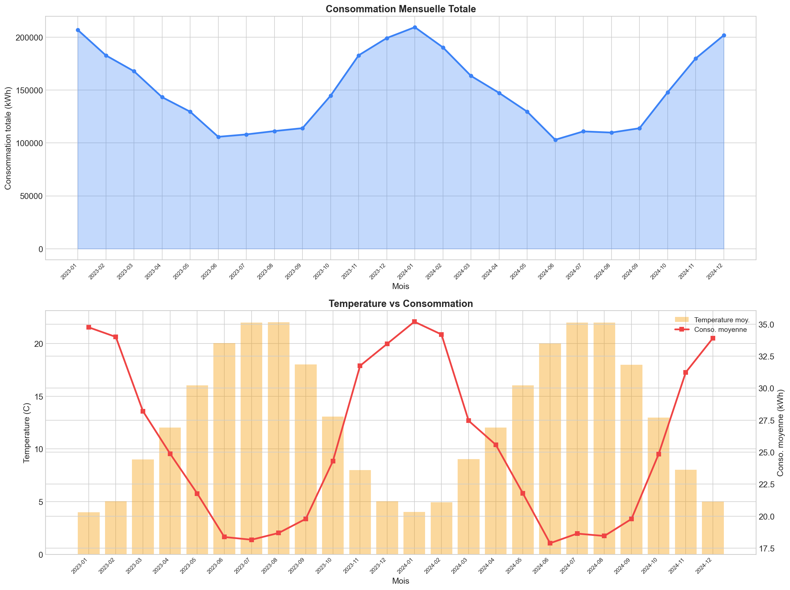
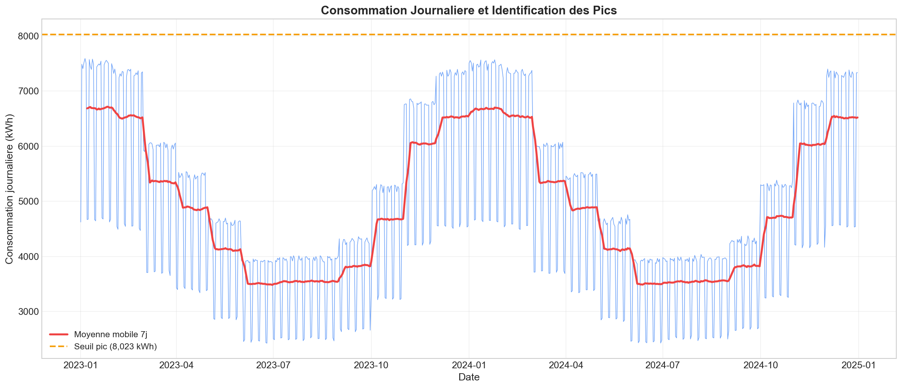

# Analyse de la Consommation Energetique

## Description

Analyse exploratoire de donnees de consommation energetique d'un parc de 8 batiments sur 2 ans. Identification des patterns de consommation, des pics energetiques et recommandations d'optimisation pour reduire les couts.

## Objectifs

- Explorer les patterns de consommation horaire, journaliere et mensuelle
- Identifier les pics de consommation et leurs causes
- Analyser l'impact de la temperature sur la consommation
- Comparer les profils de consommation par type de batiment
- Formuler des recommandations d'optimisation

## Dataset

- 8 batiments (Bureaux, Residentiels, Commerciaux, Industriel)
- 2 ans de donnees horaires (2023-2024)
- 140 000+ enregistrements
- Variables : consommation kWh, temperature, cout, type de tarif

## Technologies

- Python
- Pandas
- Matplotlib
- Seaborn
- SciPy

## Insights cles

- Pic de consommation entre 9h-12h et 18h-21h
- Correlation significative temperature-consommation
- Les bureaux consomment 40 pourcent de plus que les residences
- Potentiel d'economie de 15 a 20 pourcent identifie

## Visualisations

### Profil de Consommation Horaire

### Heatmap Jour x Heure

### Saisonnalite et Temperature

### Pics de Consommation

## Recommandations

1. Reduire la consommation des bureaux le weekend
2. Automatiser l'extinction des equipements apres 20h
3. Ajuster le chauffage et la climatisation selon la temperature
4. Decaler les process energivores en heures creuses (22h-6h)

## Auteur

Zakarya Guehche - Data Analyst et Data Scientist